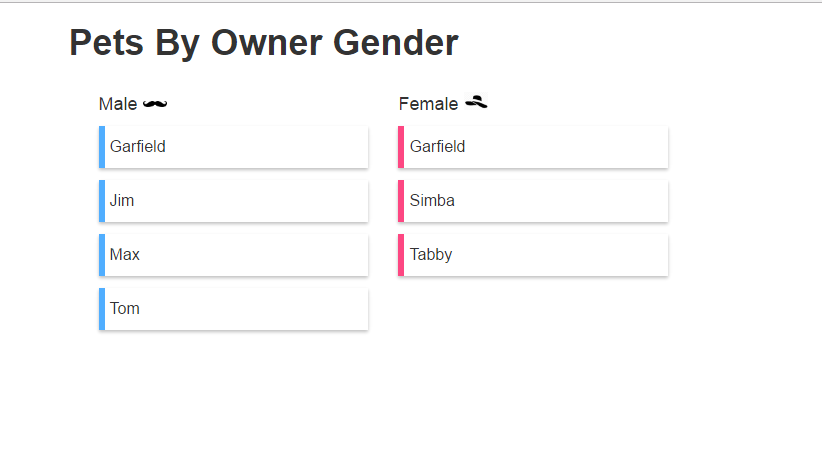

# AGL CODING TEST

Create a react application to display cats

>A sample project to demonstrate the consumption of an AGL service and display the list of cats in alphabetical order categorized by owner's gender

```bash
# Web service url
http://agl-developer-test.azurewebsites.net/people.json
```
* Development using ReactJS.
* Module bundling using webpack
* Babel for compilig the code
* Testing and code coverage using JEST


## Prerequisites

1. Install [Node.js](http://nodejs.org)

## QuickStart

```bash
# clone the repo
# --depth 1 removes all but one .git commit history
git clone --depth 1 https://github.com/SaileshMS/agl-coding-test.git

# change directory to our repo
cd agl-coding-test

# install the dependencies and dev dependencies with npm
npm install

# start the server
npm start
```
go to  [http://localhost:8080](http://localhost:8080) in your chrome browser

## File Structure

```
agl-coding-test/
 ├──__test__/                      * Unit test files included in this folder
 ├──coverage/                      * Code coverage files included in this folder
 ├──dist/                          * Our distribution build folder
 ├──docs/                          * Documents folder
 ├──node_modules/                  * npm package folder
 │
 ├──src/                           * our source files that will be compiled to javascript
 |   ├──index.html                 * Index.html: where we generate our index page
 │   ├──app/                       * WebApp: folder
 │       ├──components             * components folder (jsx file)
 |       |     ├──App.jsx          * App component
 │       |     └──Pet.jsx          * Pet component
 │       ├──app.css                * css file for styling
 ├──package.json                   *  what npm uses to manage it's dependencies
 ├──.bablerc                       * babel configuration
 ├──package.json                   * what npm uses to manage it's dependencies
 └──webpack.config.js              * webpack main configuration file

```

## Scripts

### run server
```bash
npm start
```

### run unit tests
```bash
npm test
```
### run build
```bash
npm build
```

## Tools used

Tools used for development of this project

- [`ReactJS`](https://facebook.github.io/react/) 
- [`Webpack`](https://webpack.js.org/) as module bundler
- [`Babel JS`](https://babeljs.io/) as the compiler.
- [`Jest`](https://facebook.github.io/jest/) testing framework and code coverage library.


## Output



## Coverage

Run the below command
```bash
npm test
```

Open the index.html file from '/coverage/lcov-report/' folder to view the code coverage report.
[HTML coverage report ](./coverage/lcov-report/index.html)

## Known Issues

The server does not support Cross Origin Resource Sharing (CORS)

To fix this, start Google Chrome with disabled web-security using the following command:

### MAC
```bash
open -a "Google Chrome" --args --user-data-dir --disable-web-security
```

### Windows
```bash
"C:\Program Files (x86)\Google\Chrome\Application\chrome.exe" --disable-web-security --user-data-dir="C:\chrome"
```

# License
 [MIT](/LICENSE)